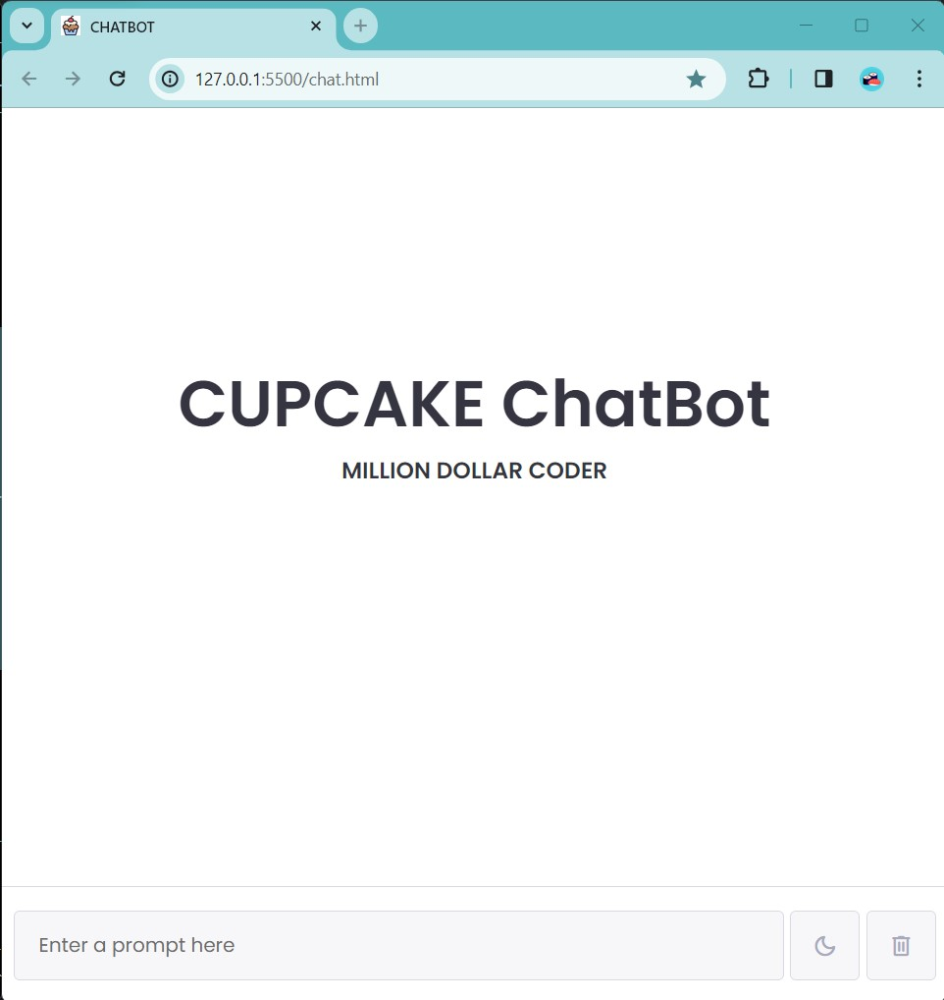
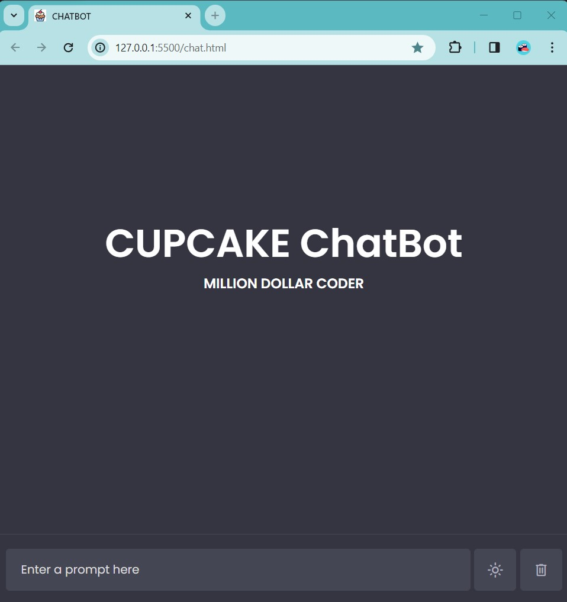

# CUP CAKE CHATBOT

BY   Million Dollar Coder 
**********************************
Project Name :  CupCake CHATBOT 

Author : 

This project was created by  VASANTH . M 

NickName : Million Dollar Coder

Language Used: HTML , CSS and JS

Software Used : VScode and google chorme

Date : 12 - 11 - 23

API : **OpenAI**

License : 

This project is open-source and available under the MIT License. You are free to use, modify, and distribute it as needed.
Please refer to the LICENSE file for more details. 

( https://github.com/vasanth312203/CHATBOT/blob/a9cff2ad1b3eabd8c398c61b9f4a87b64ccd845a/LICENSE )


Description :

Unlock the power of conversational AI by embarking on a journey to create your very own ChatBot interface using the  HTML, CSS, and JavaScript. This hands-on project combines the structural elements of HTML, the styling finesse of CSS, and the interactive capabilities of JavaScript to craft an engaging chatbot experience.

HTML (chat.html)

Begin by defining the skeletal structure of your chat interface using HTML. Set up the necessary elements for the chat window, input field, and message containers. Organize the layout to provide a clean and user-friendly design.

CSS (style.css)

Elevate the visual appeal of your chat interface with CSS styling. Apply aesthetic choices for colors, fonts, and layout to create a seamless and visually pleasing experience. Use CSS to ensure responsiveness and adaptability to different screen sizes.

JAVA SCRIPT ( script.js )

 The heartbeat of your ChatBot interface lies in the interactivity enabled by JavaScript. Implement event listeners to capture user input, create functions for processing messages, and dynamically update the chat window. Utilize JavaScript to seamlessly integrate the chatbot logic and responses. 
 
 Integration with OpenAI API :
 
Take your project to the next level by integrating it with the OpenAI GPT API for more sophisticated natural language processing. This step involves making API requests to the OpenAI servers, handling responses, and seamlessly integrating the generated responses into your chat interface.

# API KEY :
**To get your API key, visit the following URL:**
```

 https://platform.openai.com/account/api-keys

```

# POST Link :

```

https://api.openai.com/v1/completions

```
 # CREATE COMPLETOIN :

**Creates a completion for the provided prompt and parameters.**

```

https://platform.openai.com/docs/api-reference/completions/create

```

Learning Outcomes:

1 , Gain proficiency in HTML for structuring web content.

2 , Develop CSS skills for enhancing visual aesthetics and responsiveness.

3 , Harness the power of JavaScript for creating dynamic and interactive web applications.

4 , Understand the basics of integrating external APIs for extended functionality.


# Light Mode :




# Dark Mode :




How to Use

1 , Download or clone the repository to your local machine.

2 , Open the chat.html file in a web browser.

3 , Download  the images folder in your project directory. This folder includes the user avatar and chatbot logo.

4 , Ask any Question to Cupcake Chatbot ..


